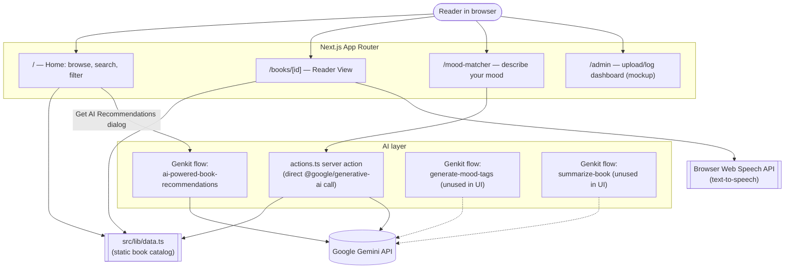

# GlobalLib Discover

An AI-assisted book discovery web app — browse a curated catalog, filter by category or mood, and get Gemini-powered reading recommendations.

## Overview

GlobalLib Discover is a Next.js application (originally scaffolded with Firebase Studio) built around one idea: help a reader find their next book by *feeling*, not just by title or genre. Readers can browse a small curated catalog, filter it by category and mood tags, or describe how they feel in plain language and let Google's Gemini model suggest matching titles. Each book has its own detail page with a "Reader View" of the full text and a built-in text-to-speech "Listen to Book" button.

The catalog itself is a static, hard-coded dataset (`src/lib/data.ts`) rather than a live database — this is a front-end/AI-features demo and prototype rather than a production catalog system. An `/admin` page exists as a visual mockup of an upload/ingestion dashboard (simulated log stream, no real backend wired up).

## Key features

- **Book browsing & search** — grid of books with cover, title, author, and description; live search by title/author (`src/app/page.tsx`, `src/components/search-filters.tsx`).
- **Category & mood filtering** — filter by category (Business, Fiction, Self-Help) and by mood tags (Inspiring, Suspenseful, Dark, etc.), reflected in the URL query string.
- **AI mood-tag recommendations** — describe your reading preferences in free text and a Genkit flow (`src/ai/flows/ai-powered-book-recommendations.ts`) returns matching mood tags to filter by, surfaced through the "Get AI Recommendations" dialog on the home page.
- **AI mood matcher page** (`/mood-matcher`) — describe how you feel right now and a Gemini call (`src/app/actions.ts`) picks the 3 best-matching books directly.
- **Book detail / Reader View** (`/books/[id]`) — full book text, mood tag badges, an affiliate purchase link, and a "Listen to Book" button powered by the browser's built-in Web Speech API (no server AI call).
- **Admin dashboard mockup** (`/admin`) — drag-and-drop upload UI and a simulated live system-log stream, for demonstration purposes only.
- Two additional Genkit AI flows are defined but not yet wired into the UI: generating mood tags from a book description, and summarizing a book's full text (`src/ai/flows/generate-mood-tags.ts`, `src/ai/flows/summarize-book.ts`). They're runnable via the Genkit dev UI.

## Tech stack

- **Framework:** Next.js 15 (App Router, Turbopack dev server), React 19, TypeScript
- **Styling/UI:** Tailwind CSS, shadcn/ui components on top of Radix UI primitives, lucide-react icons
- **AI:** Google Genkit (`genkit`, `@genkit-ai/google-genai`) for structured AI flows, plus a direct `@google/generative-ai` (Gemini) call for the mood matcher
- **Forms/validation:** react-hook-form + Zod
- **Other:** Firebase SDK (present as a dependency; used for deployment via Firebase App Hosting — see `apphosting.yaml` — not for app data), Recharts, embla-carousel

## Architecture



## Setup & installation

Requires Node.js (see `@types/node ^20` in devDependencies — Node 20+ recommended) and npm.

```bash
# 1. Clone the repo
git clone https://github.com/srksourabh/GlobalLib-Discover.git
cd GlobalLib-Discover

# 2. Install dependencies
npm install

# 3. Configure environment variables
# Create a .env.local file with a Google AI (Gemini) API key —
# required for both the Genkit flows and the mood-matcher server action.
echo "GEMINI_API_KEY=your_key_here" > .env.local

# 4. Run the dev server (Next.js, with Turbopack, on port 9002)
npm run dev
```

Optional: run the Genkit developer UI to inspect/test the AI flows directly (`recommendBooks`, `generateMoodTags`, `summarizeBook`):

```bash
npm run genkit:dev
# or, to auto-reload on file changes:
npm run genkit:watch
```

Other available scripts:

```bash
npm run build       # production build
npm run start        # start the production server
npm run lint          # next lint
npm run typecheck  # tsc --noEmit
```

## Usage

1. Start the dev server and open `http://localhost:9002`.
2. On the home page, search by title/author, filter by category, or click a mood tag to narrow the catalog.
3. Click **Get AI Recommendations** to describe your reading tastes in free text — the AI suggests mood tags you can apply as a filter.
4. Visit **Mood Matcher** (`/mood-matcher`) to describe how you're feeling right now and get 3 AI-picked book suggestions.
5. Click into any book to open its **Reader View**, read the full text, or press **Listen to Book** to have it read aloud via your browser's text-to-speech.
6. The **Admin** page (`/admin`) is a visual mockup only — uploads and logs shown there are simulated, not connected to real storage.

Deployment is configured for Firebase App Hosting (`apphosting.yaml`), but the app can be deployed to any Node.js-compatible host that supports Next.js.
